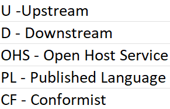

# ddd-contextmap

This repository show the Context Map of HermesFoods application.

## Microservices Architecture

## Steps to run

In this project we use the context mapper tool to create our context map, as step by step below:

- Clone the repository;
- git clone https://github.com/HermesFoods/ddd-context-map.git
- Install the [Context Mapper] (https://marketplace.visualstudio.com/items?itemName=contextmapper.context-mapper-vscode-extension) extension for Visual Studio Code;
- Download and install Java 17 from https://www.oracle.com/java/technologies/javase/jdk17-archive-downloads.html
- Download and install the latest version of Graphviz from https://graphviz.org/download/
- Open the context-map-details.cml file in Visual Studio Code;
- Right-click on the Context Map code > Generate Graphical Context Map.

## Subtitle

## Subdomain Classification

